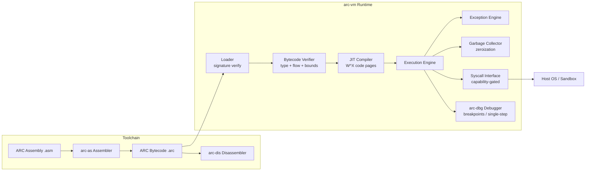
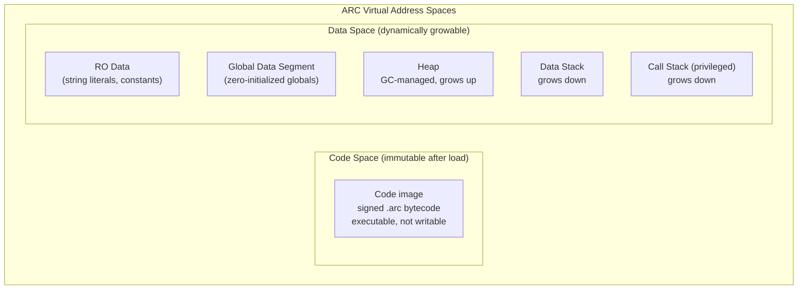
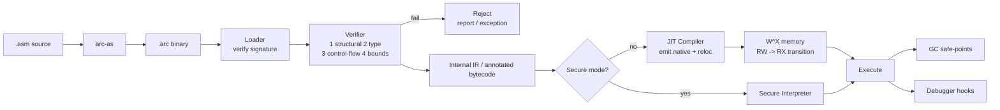
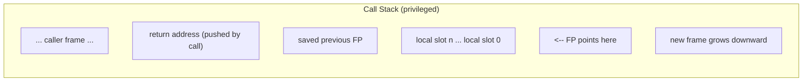
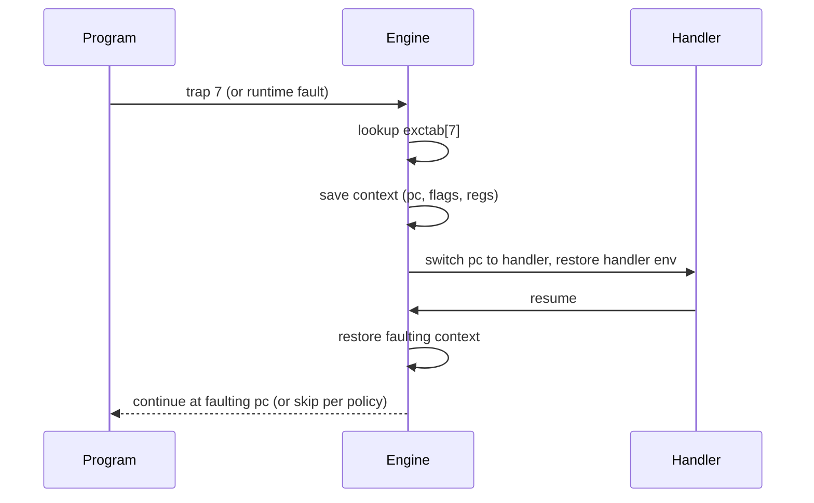

# ARC Virtual Machine — Architecture Specification

**Project:** ARC
**Status:** Draft v0.1 (greenfield)
**Purpose:** High-level architecture first, detailed specification second. Written for the original author and for future generations of specialists working on ARC (military-grade confidentiality and security environments).

---

## Table of Contents

1. [Executive Summary](#1-executive-summary)
2. [Design Philosophy](#2-design-philosophy)
3. [Decisions and Rationale](#3-decisions-and-rationale)
4. [System Overview](#4-system-overview)
5. [Registers](#5-registers)
6. [Memory Model](#6-memory-model)
7. [Data Types](#7-data-types)
8. [Instruction Set Architecture (ISA)](#8-instruction-set-architecture-isa)
9. [Assembly Language (Syntax Proposal)](#9-assembly-language-syntax-proposal)
10. [Binary Format](#10-binary-format)
11. [Execution Model](#11-execution-model)
12. [JIT Compiler](#12-jit-compiler)
13. [Concurrency](#13-concurrency)
14. [Calling Convention](#14-calling-convention)
15. [Exception Handling](#15-exception-handling)
16. [Syscall & I/O Model](#16-syscall--io-model)
17. [Security Architecture](#17-security-architecture)
18. [Tooling](#18-tooling)
19. [Debugging](#19-debugging)
20. [Roadmap](#20-roadmap)
21. [Appendices](#21-appendices)

---

# Part I — High-Level Architecture

## 1. Executive Summary

ARC is a **register-based virtual machine** written in **Go**, with a native **32-bit word size** and a **custom assembly language**. It executes fixed-width (4-byte) instructions through a **JIT compiler**, supports **concurrency**, and enforces a strict **Harvard-style separation** between code and data.

ARC is designed first and foremost for **maximum confidentiality and security**: memory-safe by construction, with signed bytecode, a verified loader, capability-gated syscalls, W^X enforcement, and eager memory zeroization. Performance is a priority *after* security.

The complete toolchain consists of:

| Tool | Role |
|---|---|
| `arc-as` | Assembler: `.asm` source → `.arc` bytecode binary |
| `arc-vm` | The virtual machine: loader, verifier, JIT, runtime |
| `arc-dis` | Disassembler: `.arc` binary → assembly listing |
| `arc-dbg` | Debugger: breakpoints, single-step, memory/register inspection |
| `arcvm` (Go package) | Embeddable host API for integrating ARC into host applications |

## 2. Design Philosophy

Every architectural decision is subordinate to this hierarchy of goals:

1. **Confidentiality** — sensitive data must not leak: between allocations, to the host, through side channels, or after deallocation.
2. **Integrity** — programs must not be tampered with (bytecode must be signed and verifiable).
3. **Availability** — an ARC program must not be able to crash the host, hang it indefinitely, or exhaust host resources without bound.
4. **Performance** — JIT-executed speed approaching native, *after* the above are satisfied.
5. **Simplicity of verification** — the semantics must be small, typed, and deterministic where required, so that formal reasoning about ARC programs is tractable.

Design consequences:

- **No raw pointers.** All references are runtime-managed handles; pointer forging is impossible. Elminimates an entire class of memory-corruption attacks.
- **No uninitialized reads.** Every allocation is zero-initialized.
- **No self-modifying code.** Harvard architecture: the code segment is immutable after load.
- **Deterministic mode.** A verified execution mode with fixed scheduling and timing instrumentation for reproducible runs.
- **Least privilege.** All I/O goes through capability-gated syscalls; no direct hardware access.

## 3. Decisions and Rationale

Decisions made on the owner's behalf (each can be reversed):

| # | Decision | Choice | Rationale |
|---|---|---|---|
| D1 | Endianness | **Little-endian** | Matches dominant host platforms (x86/ARM); simplest interop |
| D2 | Memory topology | **Harvard** (separate code/data) | W^X by construction; immune to code injection |
| D3 | Heap management | **Tracing GC + eager zeroization** (zero-on-allocate and zero-on-free) | Prevents UAF/double-free/leaks; zeroing prevents data leakage between allocations and after deallocation |
| D4 | Stack model | **Two separate stacks**: call stack (frames, return addresses) + data stack (operands) | Call stack is privileged and unaddressable — return addresses cannot be overwritten by data bugs |
| D5 | Calling convention | **Standard stack frames** with `enter`/`leave`, `fp`-anchored | Recursion-safe, supports tail calls, easy debugging |
| D6 | Instruction width | **Fixed 4-byte instructions** | Simple decode, JIT-friendly, predictable alignment |
| D7 | Execution | **JIT with optional secure-interpreter fallback** | Speed is priority #4; interpreter retained for air-gapped/constrained environments |
| D8 | Exception model | **Synchronous exception table + TRAP/RESUME** | Structured, verifiable, Go-friendly |
| D9 | Concurrency | Go-goroutine-backed VM threads + atomic ops + futex-style sync | Fits the host; deterministic mode available |

---

## 4. System Overview



Data flows: `arc-as` translates human-written assembly into a signed, verifiable binary; `arc-vm` verifies it, JIT-compiles it into native code on W^X pages, and runs it under a capability-restricted syscall interface. `arc-dis` and `arc-dbg` operate on the same binary format.

## 5. Registers

All registers are **32-bit**. ARC defines **16 general-purpose registers (GPRs)** plus **5 special-purpose registers**.

| Register | Class | Purpose |
|---|---|---|
| r0 – r3 | GPR | Argument / return / caller-saved scratch |
| r4 – r11 | GPR | Callee-saved (preserved across calls) |
| r12 – r13 | GPR | Assembler scratch (clobberable) |
| r14 – r15 | GPR | Reserved for VM runtime / trampolines |
| pc | Special | Program counter (code segment only; read-only for programs) |
| csp | Special | Call stack pointer (privileged, not addressable by programs) |
| dsp | Special | Data stack pointer |
| fp | Special | Frame pointer (anchors current call frame) |
| flags | Special | Condition flags and machine state |

**FLAGS layout:**

| Bit | Name | Meaning |
|---|---|---|
| 0 | z | Zero (last result was 0) |
| 1 | n | Negative (last result was negative) |
| 2 | c | Carry |
| 3 | v | Overflow (signed) |
| 4 | t | Trap flag (single-step, set by debugger) |
| 5–31 | — | Reserved, always 0 |

Security notes:

- `r0` is the standard return-value register.
- `pc`, `csp`, and `fp` cannot be written by user instructions; only the VM runtime and the instructions `call`, `ret`, `enter`, `leave`, `resume` mutate them. This prevents control-flow hijacking through register corruption.
- The **call stack is not addressable** from data instructions — return addresses can never be overwritten by a data bug (decision D4).

## 6. Memory Model

### 6.1 Topology

Harvard-style: **code and data live in separate address spaces**. Code is loaded once, verified, and made immutable; data memory is dynamically growable.



- **Code space**: fixed after load; any write to it or indirect branch into it is a runtime exception. This is the W^X guarantee (decision D2).
- **RO data**: string literals and read-only constants; writes are a runtime exception.
- **Global data**: zero-initialized at load.
- **Heap**: grows dynamically; backing memory is added in page-sized chunks; guard pages surround reserved regions.
- **Data stack**: operand stack (PUSH/POP); overflow and underflow are runtime exceptions.
- **Call stack**: privileged; holds frames and return metadata; overflow raises a stack-overflow exception.

### 6.2 Growth and Bounds

- Memory grows via an internal **virtual memory manager (VMM)**; reserving never commits, committing is lazy (touch-to-map) to bound host resource use (goal #3).
- Every load/store is bounds-checked. Out-of-bounds access raises an exception — never undefined behavior.
- Heap and both stacks are surrounded by **guard pages** to catch runaway access.

### 6.3 Heap Management (GC)

Decision D3: **automatic tracing garbage collection with eager zeroization**.

- **Zero-on-allocate**: fresh memory is always zeroed, so no data ever leaks *between* allocations.
- **Zero-on-free / reclaim**: when the GC reclaims an object (or the program explicitly frees), memory is zeroized *before* returning to the free lists.
- **Compacting mark-and-sweep GC** is the primary plan: prevents fragmentation, improves cache behavior. The JIT cooperates via **safe-points** and **precise stack maps** so compaction can move objects safely.
- **Explicit `free`** is available for performance-sensitive code; the runtime zeroizes immediately and records a tombstone so a double-free raises an exception rather than corrupting memory.
- The GC is **incremental** and **pause-bounded** (goal #3).

## 7. Data Types

ARC is a **typed** machine: the verifier statically type-checks bytecode; runtime representations are unambiguous.

### 7.1 Primitive types

| Type | Size | Notes |
|---|---|---|
| `bool` | 1 byte | Must be 0 or 1; enforced |
| `i8` / `u8` | 1 byte | Signed / unsigned |
| `i16` / `u16` | 2 bytes | |
| `i32` / `u32` / `f32` | 4 bytes (one word) | Native word types |
| `i64` / `u64` / `f64` | 8 bytes | Register pairs or memory |
| `ptr` | 4 bytes | **Opaque, managed reference**; never raw arithmetic |
| `string` | 4-byte handle | Immutable UTF-8; runtime-managed |

### 7.2 Pointer model (automatic — performance and safety)

- Pointers are **opaque handles**, not addresses. Programs cannot read or write the numeric value of a pointer except through equality comparisons (`==`, `!=`) — pointer forging is impossible.
- The JIT *internally* uses real addresses for speed, but the ISA exposes only handles: native performance with verified safety.
- Pointer validity is guaranteed by the GC: no dangling pointers, no use-after-free.
- **Bounds-checked arrays**: indexing instructions are range-checked against the array's length header.

### 7.3 Aggregate types

| Type | Layout | Notes |
|---|---|---|
| `array<T>` | length header + contiguous `T[]` | Fixed at creation; bounds-checked |
| `struct` | fixed layout, aligned per member | Zero-initialized; **padding is zeroed at construction** so gaps never carry stale data |

### 7.4 Type safety

- Static typing at the bytecode level (typed instruction variants and/or verifier-inferred types, see §11.2).
- No unions, no type punning in user code.
- Reading uninitialized memory is impossible by construction (zero-initialized allocations).

## 8. Instruction Set Architecture (ISA)

### 8.1 Instruction encoding

All instructions are exactly **4 bytes (one word)**. Every instruction begins with a **condition nibble** and a **primary opcode nibble**, enabling uniform conditional execution (ARM-style).

```
Byte 0          Byte 1          Byte 2          Byte 3
+------------------------------------------------------+
| cond (4) | op (4) |  operand fields (24 bits)         |
+------------------------------------------------------+
bits 31..28     27..24         bits 23..0
```

**Condition field (`cond`)** — every instruction may execute conditionally:

| cond | Mnemonic | Meaning |
|---|---|---|
| 0 | al | Always execute (default) |
| 1 | eq / z | Equal / zero |
| 2 | ne / nz | Not equal / non-zero |
| 3 | cs / c | Carry set |
| 4 | cc / nc | Carry clear |
| 5 | mi / n | Negative |
| 6 | pl / nn | Positive or zero |
| 7 | vs / v | Overflow set |
| 8 | vc / nv | Overflow clear |
| 9 | gt | Signed greater |
| 10 | ge | Signed greater-or-equal |
| 11 | lt | Signed less |
| 12 | le | Signed less-or-equal |
| 13 | hi | Unsigned higher |
| 14 | ls | Unsigned lower-or-same |
| 15 | — | (reserved) |

Condition mnemonics are written **lowercase** in assembly (the no-all-caps rule, §9).

### 8.2 Operand formats (the 24-bit operand field)

| Format | Layout (bits 23..0) | Used by |
|---|---|---|
| **RRR** | `rd(5) rs1(5) rs2(5) flags(4) res(5)` | 3-operand arithmetic/logic |
| **RRI** | `rd(5) rs1(5) imm(14 signed)` | 2-register + small immediate |
| **RI** | `rd(5) imm(19 signed)` | register + immediate |
| **RR** | `rd(5) rs1(5) res(14)` | move / 2-operand |
| **J** | `offset(20 signed, word-granular)` | PC-relative jumps/calls |
| **S** | `vec(8) res(16)` | syscall / trap vectors |

Notable properties:

- Immediates are **sign-extended**. The 20-bit J-offset is word-granular (byte offset = word × 4), spanning ±512K words (±2 MB) — enough for most code; long jumps use the indirect form (`jmp [r]`).
- Constants wider than the immediate field use a **constant-loading pair**: `ldi` (low bits) + `ldhi` (high bits), documented in the instruction reference.
- 64-bit types use **register pairs** `(r_{2n+1}:r_{2n})` — low word in the even register — or memory operands.

### 8.3 Instruction catalog

The complete opcode table is assigned during implementation (see Appendix C). Categories and mnemonics:

**Arithmetic**

`add sub mul mulu div divu mod neg inc dec cmp adc sbb`

**Logic & bitwise**

`and or xor not shl shr sar rol ror test`

**Data movement**

`mov ldi ldhi movhi lea load store loadb storeb loadh storeh`

- `load`/`store` — word; `loadb`/`storeb` — byte; `loadh`/`storeh` — halfword.
- Addresses come only from `base + offset` forms; every access is bounds-checked.

**Stack (data stack)**

`push pop pushf popf`

**Control flow**

`jmp jcc` — all conditions from §8.1 (`je jne jl jle jg jge jo jno js jns jc jnc jbe ja ...`)

**Functions**

`call ret enter leave`

- `call` targets: label (J format), register, or memory (function pointers).
- `enter size` / `leave` — frame prologue/epilogue (§14).

**System & exceptions**

`syscall trap resume halt nop`

- `syscall vec` — capability-gated system call (§16).
- `trap code` — raise a user exception (§15).
- `resume` — return from an exception handler.

### 8.4 Flags behavior

- Arithmetic/logic ops write `z n c v` from the result.
- `cmp` / `test` set flags without storing a result.
- A skipped conditional instruction has **no side effects and raises no exceptions**.

## 9. Assembly Language (Syntax Proposal)

> **Status: REVISED DRAFT.** Owner requirements incorporated: simplified for ease of parsing and running, human-readable, and **no ALL-CAPS anywhere** — the canonical style is lowercase.

### 9.0 Design principles

1. **Lowercase canonical.** All mnemonics, directives, registers, and labels are written lowercase. The parser itself is case-insensitive (a forgiving assembler), but `arc-as --style-check` rejects uppercase tokens so official code stays uniform. There is no ALL-CAPS in the language.
2. **One token per operand.** Operands are separated by whitespace; commas are optional and ignored where they appear. Memory operands are written **without inner spaces** (`[r1+4]`), so they are a single token.
3. **No shorthand forms.** Each instruction has exactly one form (no accumulator shortcuts): `add r1, r2, 5` is valid; `add r1, 5` is not accepted. Encoding stays table-driven and JIT decode stays trivial.
4. **`#` marks immediates.** Anything preceded by `#` is a value; bare identifiers are labels or registers. No ambiguity, no lookahead.
5. **Flat sections.** `.code`, `.data`, `.rodata` replace `.section <name>`.

### 9.1 Lexical conventions

- **Comments**: `;` to end of line; block comments `/* ... */`. Comments are stripped first, so a `;` inside a string literal is not a comment.
- **Identifiers**: `[a-z_][a-z0-9_]*` (the parser tolerates uppercase; style-check rejects it). Labels end with `:`.
- **Numbers**: decimal `42`, hex `0x2a`, binary `0b101010`, octal `0o52`; floats `3.14`, `-1.5e3`; character literals `'a'` with escapes.
- **Strings**: double-quoted `"..."` with escapes `\n \t \\ \" \xNN \uNNNN`.
- **Registers**: `r0`–`r15`; specials `pc`, `dsp`, `fp`, `flags` (`csp` is inaccessible to programs).

### 9.2 Operand forms

| Form | Example | Notes |
|---|---|---|
| Register | `r3` | `r0`–`r15`, `pc`, `dsp`, `fp` |
| Immediate | `#42`, `#0x2a`, `#limit` | constant or constant name |
| Label | `loop` | data or code address, resolved at assembly |
| Memory | `[r1+4]`, `[r1+r2*4]`, `[r1]` | **no spaces inside brackets**; shapes: `[base]`, `[base+off]`, `[base+index*scale]` with `scale` ∈ {1,2,4,8} |
| Indirect call | `[r7]` as sole target | function pointers: `call [r7]` |

### 9.3 Grammar (formal)

```
program       := (label | directive | instruction | comment)*
label         := ident ':'
directive     := '.' mnemonic (operand (','? operand)*)?
instruction   := mnemonic ['.' cond] (operand (','? operand)*)?
operand       := '#' (number | ident) | reg | '[' memexpr ']' | ident | number | string
memexpr       := reg ('+' (reg ['*' scale] | number))?
comment       := ';' rest | '/*' text '*/'
```

The grammar is unambiguous — the operand count for each mnemonic is fixed and table-driven; a conditional suffix (see §9.5) does not change the operand count. This is what makes ARC assembly trivially parseable and cheap to assemble.

### 9.4 Directives

| Directive | Meaning |
|---|---|
| `.code` / `.data` / `.rodata` | Switch current section |
| `.word v1, v2, ...` | Emit 32-bit words |
| `.half v1, ...` | Emit 16-bit values |
| `.byte v1, ...` | Emit 8-bit values |
| `.string "..."` | Zero-terminated UTF-8 (auto-placed in `.rodata`) |
| `.const name value` | Named constant (assembler-time), e.g. `.const limit 40` |
| `.align n` | Align to n bytes |
| `.global name` | Export symbol |
| `.extern name` | Import symbol |
| `.macro name args...` / `.endm` | Macro definition |
| `.org addr` | Set output address |

### 9.5 Mnemonics and conditions

- Mnemonics are the lowercase names from §8.3 (`mov`, `add`, `call`, `syscall`, ...).
- **Jumps** always carry their condition: `je`, `jne`, `jl`, `jle`, `jg`, `jge`, `jo`, `jno`, `js`, `jns`, `jc`, `jnc`, `jbe`, `ja`; `jmp` is the unconditional form.
- **Predicated arithmetic** (optional, mirrors the ISA condition nibble): append the condition to the mnemonic — `add.eq r0, r0, r1`. The unconditional form is the default; prefer explicit `je` in hand-written code.

### 9.6 Example program (lowercase style)

```
; ---------------------------------------------------------------
; sums the values of an array
; lowercase style, single-token operands, immediate prefix #
; ---------------------------------------------------------------
.const arr_len 4

.rodata
msg:   .string "sum: "

.data
arr:   .word 10, 20, 30, 40

.code
.global entry
entry:
    enter 0                 ; prologue
    mov  r1, arr            ; array handle (opaque pointer)
    mov  r0, #0             ; accumulator
    mov  r2, #0             ; index
loop:
    cmp  r2, #arr_len
    jge  done               ; signed >=
    load r3, [r1+r2*4]      ; bounds-checked indexed load
    add  r0, r0, r3
    inc  r2
    jmp  loop
done:
    syscall 1               ; write(stdout, msg)
    syscall 3               ; write_int(stdout, r0)
    syscall 0               ; exit(0)
    halt
```

### 9.7 Assembler guarantees and style policy

- `arc-as` resolves all labels and constants at assembly time; the output `.arc` needs no symbol resolution at load.
- The assembler pads `.code` to word alignment, fixes up PC-relative `j`-format offsets, and rejects a conditional suffix combined with a conflicting `jcc` form.
- The indexed form `[r1+r2*4]` is encoded via the `flags` nibble of the RRR/RRI formats (§8.2); the verifier confirms index bounds where statically knowable.
- **No-all-caps rule is mechanical**: `arc-as --style-check` fails on any uppercase mnemonic, directive, or register spelling.

---

# Part II — Detailed Specification

## 10. Binary Format

The `.arc` binary is a custom format with integrity protection.

```
+------------------------------------------------------+
| Magic        "ARCV1" (4 bytes)                        |
| Version      u32                                      |
| Flags        u32  (bit0: requires JIT,                |
|                    bit1: requires deterministic mode, |
|                    ...)                               |
| Entry        u32  (code offset of _start)             |
| Section table: count + [name, type, vaddr, size,      |
|                 file offset, permissions, hash]       |
| Sections:     code (immutable)                        |
|               rodata                                  |
|               data                                    |
|               symtab (symbols + source line info)     |
|               exctab (exception vectors)              |
| Signature    Ed25519 over everything above            |
+------------------------------------------------------+
```

- **Signature**: every production `.arc` binary is signed (Ed25519). `arc-vm` refuses unsigned or invalidly signed binaries unless explicitly overridden in development mode.
- **Per-section hashes** (SHA-256) enable incremental integrity checks and safe zero-copy loading.
- **symtab** carries symbols and source-line mappings for the disassembler and debugger.
- **exctab** maps exception vectors to handler addresses (§15).

### 10.1 ABI stability

The binary format is **versioned**. The loader supports exactly one format version per binary (no silent compatibility tricks); format evolution goes through the version field and is documented in a changelog.

## 11. Execution Model

### 11.1 Pipeline



### 11.2 Load-time verification (the verifier)

Before any code runs, `arc-vm` runs a **static verifier** that is *pessimistic by default*:

1. **Structural pass** — instruction boundaries, alignment, opcode/format validity, reserved-bit checks.
2. **Type pass** — operand types are tracked statically; type mismatches are rejected (no runtime type confusion).
3. **Control-flow pass** — jump/call targets are inside the code section at instruction boundaries; no fall-through off the end; call depth bounded where checkable.
4. **Bounds pass** — offsets proven in-bounds when statically knowable; the remainder get explicit runtime checks emitted by the JIT.
5. **Resource pass** — per-frame stack usage is statically bounded; total memory commitments are capped by host policy (goal #3).

Anything the verifier cannot prove safe is either (a) instrumented with a runtime check, or (b) rejected.

### 11.3 Engines

- **Primary engine: JIT** (§12).
- **Fallback engine: secure interpreter** — a switch-based loop over verified bytecode, for environments where JIT is banned (air-gapped, formally-assured deployments) — decision D7.
- Both engines share the same GC, exception, and syscall infrastructure. **Deterministic mode** guarantees bit-identical results across engines.

## 12. JIT Compiler

### 12.1 Strategy

- **Function-at-a-time JIT with lazy compilation**: functions compile on first call, then are cached behind native-code stubs. Hot-path profiling is roadmap (not initial scope).
- Output: **position-independent machine code** for the host (amd64 first, then arm64).
- **W^X discipline**: code is emitted into RW memory, then transitioned to RX. Never RWX.
- **ASLR**: JIT buffers are allocated at randomized addresses per run.

### 12.2 Safety mechanisms

| Threat | Mitigation |
|---|---|
| Code injection | W^X; code buffer is never writable after publish |
| Return-oriented programming | Return addresses live on the privileged call stack (shadow-stack equivalent enforced by the VM) |
| Spectre (JIT) | Constant-time codegen for sensitive ops; serializing barriers around secret-dependent branches (policy-controlled) |
| Meltdown-class | N/A — VM never touches kernel memory; runtime only |

### 12.3 GC integration

- **Precise stack maps**: the JIT records live reference locations per safe-point so the GC can move/compact objects.
- Safe-points are placed at back-edges and calls; long-running loops yield periodically.

### 12.4 Constant-time / side-channel policy

- The ISA and JIT support **constant-time variants** of arithmetic (e.g., `ct_add`) for cryptographic and classification-sensitive code.
- In **deterministic mode**, execution timing is instrumented and reproducible (for test and verification runs).

## 13. Concurrency

- VM threads are lightweight and map to Go goroutines on the host.
- Shared memory is allowed only for explicitly-shared GC objects; the runtime provides:

| Primitive | Purpose |
|---|---|
| `atomic_*` instructions (`atomic_add`, `atomic_xchg`, `atomic_cmpxchg`; acquire/release load/store) | Lock-free updates |
| `syscall mutex_lock / mutex_unlock` | Blocking mutual exclusion |
| `syscall sem_wait / sem_post` | Semaphores |
| `syscall futex_wait / futex_wake` | Low-level waits (futex-style) |
| `syscall thread_create / thread_join / thread_yield` | Thread lifecycle |

- **Deterministic mode**: fixed round-robin scheduling quantum and no host-dependent timing, enabling reproducible concurrent behavior for verification.

## 14. Calling Convention

Decision D5 — standard stack frames.

### 14.1 Rules

- **Argument registers**: first 4 arguments in `R0`–`R3`; further arguments pushed on the **data stack** (documented order — callee pops them into locals during prologue).
- **Return value**: `R0` (32-bit). 64-bit returns use the pair `R1:R0`.
- **Caller-saved**: `R0`–`R3` (clobbered by calls).
- **Callee-saved**: `R4`–`R11` (preserved across calls).
- **Scratch**: `R12`–`R13` (assembler temporaries, no preservation guarantees).
- **Reserved**: `R14`–`R15` (VM runtime only; user code must treat them as volatile).
- **Frame discipline**: `call` pushes the return address on the **call stack**; `enter n` allocates the frame and copies `fp`; `leave` restores; `ret` pops the return address. Frames live on the call stack; operands/locals beyond registers live on the data stack.

### 14.2 Frame layout



- `enter size`: allocates `size` bytes of zeroed locals on the data stack region associated with the frame and links `fp := csp`-anchored records. The exact home-frame encoding is implementation-defined but versioned.
- **Recursion**: fully supported (each call pushes a new frame).
- **Tail calls**: the JIT rewrites `call`+`ret` chains into jumps when the caller frame is dead — required for deep recursion in security-critical loops.
- **Function pointers**: any handle to a function symbol; invoked via `call [r]` / `call [mem]`; the verifier confirms the target is a valid code pointer.

## 15. Exception Handling

Decision D8 — structured, synchronous exceptions.

### 15.1 Model

- **Sources of exceptions**: user `trap code`, runtime-generated faults (divide-by-zero, out-of-bounds, stack overflow, null dereference, unresolvable syscall), and debugger events (breakpoint, single-step with the `t` flag).
- **Exception table (exctab)**: maps vector numbers to handler addresses, installed at load from the `.arc` section, extensible at runtime via `syscall exc_register`.
- **Delivery**: on exception, the engine:
  1. records the faulting context (PC, FLAGS, registers) into an exception context record,
  2. switches to the handler for the vector (most specific handler wins),
  3. clears `T` unless in debug mode.
- **Nested exceptions**: allowed up to a depth limit (host-policy configurable); exceeding the limit aborts the run deterministically.
- **Unhandled exception**: the VM halts with a structured error code and audit record (see §16).



### 15.2 Go-side mapping

- Host API surfaces exceptions as typed Go errors / `panic`-style signals with the full ARC context attached (vector, PC, handler chain) for logging and forensics.

## 16. Syscall & I/O Model

### 16.1 Capability model

- **No direct hardware or OS access** — all host interaction goes through the `syscall` instruction, with the vector in the immediate and arguments in registers `r0`–`r3`.
- Every program is launched with an explicit **capability set** (granted by host policy, least privilege). A syscall not covered by the capability set raises a capability exception.
- Capabilities are carried in an opaque token that programs cannot forge or extend.

### 16.2 Initial syscall table (vector numbers reserved at implementation time)

| vec | Syscall | Capability required |
|---|---|---|
| 0 | `exit(status)` | always |
| 1 | `write(fd, ptr, len)` | `io.write.<fd>` |
| 2 | `read(fd, ptr, len)` | `io.read.<fd>` |
| 3 | `write_int(fd, i32)` | `io.write.<fd>` |
| 4 | `open(path, mode)` | `fs.open.<path>` (path allow-list) |
| 5 | `close(fd)` | — |
| 6 | `time()` | `time` |
| 7 | `random(buf, len)` | `crypto.rng` (host CSPRNG only) |
| 8 | `thread_create / thread_join / thread_yield` | `threads` |
| 9 | `mutex_lock / mutex_unlock` | `sync` |
| 10 | `sem_wait / sem_post` | `sync` |
| 11 | `futex_wait / futex_wake` | `sync` |
| 12 | `exc_register(vec, handler)` | `exc` |
| 13 | `audit(record)` | `audit.write` |
| 14 | `secure_wipe(ptr, len)` | always (zeroizes; GC equivalent) |

- **stdin/stdout/stderr** are pre-opened descriptors `0`, `1`, `2`.
- **Audit trail**: security-relevant events (syscall entry/exit, exceptions, capability denials, GC zeroizations) may be written to a host-verifiable audit log; enabling it is a load-time policy decision.

## 17. Security Architecture

This section consolidates every security property into one threat model and requirement list.

### 17.1 Assets protected

1. Program data in memory (confidentiality at rest and in motion).
2. Program code integrity (authenticity of the binary).
3. Host integrity and availability (sandboxing).

### 17.2 Threat model

| Threat | Defense |
|---|---|
| Malicious bytecode (injection, exploit) | Signed binaries + static verifier + W^X + memory safety |
| Data leakage between processes/allocations | Zero-on-allocate, zero-on-free, guard pages |
| Tampering with program or its inputs | Ed25519 signatures, per-section SHA-256 |
| Exfiltration via I/O | Capability-gated syscalls, path allow-lists, audit |
| Side channels (timing, cache) | Constant-time op variants; deterministic mode; policy-controlled serializing barriers |
| Host takeover from guest | No raw pointers; no syscalls outside sandbox; bounded resource commitments |
| Reverse engineering of classified routines | (Optional, roadmap) bytecode obfuscation stage in `arc-as`; secure-interpreter-only deployments |

### 17.3 Security invariants (must always hold)

1. Every instruction executed is either statically verified or runtime-checked.
2. No guest operation can read host process memory.
3. No guest operation can write code memory (W^X).
4. No freed or unallocated memory is ever readable.
5. No capability can be forged or escalated.
6. Execution is bounded in time and memory (per host policy) — no unbounded loops without interruption points, no unbounded allocation.
7. In deterministic mode, identical inputs yield bit-identical outputs and identical audit records.

### 17.4 Go implementation notes

- The VM core (`arcvm` package) must avoid `unsafe` except inside tightly-reviewed internals (JIT emission, GC movement); all pointer exposure to guest code goes through handle abstraction.
- JIT code pages are managed by a dedicated allocator using platform `mmap`/`VirtualAlloc` with proper page protections; no `RWX` mappings anywhere.
- All panic sites in Go are recovered at the VM boundary and converted into ARC exceptions with full context.

## 18. Tooling

| Tool | Language | Responsibility |
|---|---|---|
| `arc-as` | Go | Parse ARC assembly → emit signed `.arc`; macro expansion; `.const`/`.equ`; section layout; fixups |
| `arc-vm` | Go | Load, verify, JIT/interpret, execute; CLI for running `.arc` files with policy flags (`--secure-mode`, `--deterministic`, `--capabilities=...`, `--audit=file`) |
| `arc-dis` | Go | Disassemble `.arc` → annotated listing (addresses, bytes, symbols) |
| `arc-dbg` | Go | Interactive debugger (breakpoints, single-step, watchpoints, memory/register views, trace) |
| `arcvm` package | Go | Embeddable API: `vm := arcvm.New(cfg); vm.Load(bin); vm.Run()` |

CLI example:

```
arc-vm --secure-mode --deterministic --capabilities=io.write.1,time,audit.write prog.arc
```

## 19. Debugging

### 19.1 Breakpoints

- **Software breakpoints**: `bkp` is encoded as the `trap` debug variant; the runtime patches the instruction stream image (code image is mutable only in debug mode) and restores on continue.
- **Hardware-style breakpoints (JIT)**: the JIT emits check hooks at marked addresses; used when the code page must stay read-only.

### 19.2 Features

| Feature | Mechanism |
|---|---|
| Single-step | Set the `t` flag → trap after one instruction |
| Watchpoints | VMM page protection + write detection in JIT |
| Stack trace | Frame chain walk on the call stack |
| Disassembly view | `arc-dis` output inline |
| Deterministic replay | Load-time recording of syscalls/GC events for replay |

## 20. Roadmap

| Phase | Scope |
|---|---|
| 0 (current) | Spec baseline; Go project skeleton; assembler + VM loop (interpreter) |
| 1 | Verifier; binary format v1; `arc-dis`; basic debugging |
| 2 | JIT (amd64); GC compaction + zeroization; concurrency primitives |
| 3 | Full debugger; audit subsystem; arm64 JIT; constant-time ops |
| 4 | Formal-verification harness; obfuscation stage; distributed verified deployment tooling |

## 21. Appendices

### Appendix A — Terminology

| Term | Definition |
|---|---|
| W^X | Write XOR eXecute: a page is writable or executable, never both |
| Safe-point | Instruction location where the GC may safely inspect/move live references |
| Stack map | Per-safe-point record of live reference locations for the GC |
| Capability | Unforgeable token granting a specific syscall right |
| Harvard architecture | Separate code and data address spaces |
| Deterministic mode | Execution mode with reproducible scheduling/timing |

### Appendix B — Sizes and Constants (normative)

| Constant | Value |
|---|---|
| Word size | 32 bits |
| Instruction width | 4 bytes (fixed) |
| GPR count | 16 |
| Special registers | 5 (PC, CSP, DSP, FP, FLAGS) |
| J-offset | 20-bit signed, word-granular (±2 MB span) |
| RRI immediate | 14-bit signed |
| RI immediate | 19-bit signed |
| Object alignment | 4 bytes (64-bit types: 8 bytes) |
| GC zeroization | Before free, before reuse, on allocate |
| max call depth (default) | 10 000 (policy-tunable) |

### Appendix C — Opcode allocation (assignment TBD during implementation)

Reserved opcode-nibble ranges by category (subject to change):

| Op range (tentative) | Category |
|---|---|
| `0x0x` | Arithmetic |
| `0x1x` | Logic / bitwise |
| `0x2x` | Data movement / memory |
| `0x3x` | Stack (data stack) |
| `0x4x` | Control flow / jumps |
| `0x5x` | Functions (CALL/RET/ENTER/LEAVE) |
| `0x6x` | System (SYSCALL/TRAP/RESUME/HALT/NOP) |
| `0x7x–0xFx` | Reserved / extension |

### Appendix D — Open questions

1. Remaining polish of **ARC assembly syntax**: the lowercase/simplified revision (§9) is agreed as the baseline; final mnemonic list and macro syntax still to be finalized.
2. Register-pair vs. dedicated wide-register treatment of 64-bit types.
3. GC algorithm finalization (compacting mark-sweep vs. copying) pending benchmark needs.
4. Whether to ship an initial **standard library** of verified primitives (string ops, crypto, containers).
5. Release signing key management for production binaries (offline CA, key ceremonies).

---

*End of document. Feedback and changes to any decision (D1–D9) are tracked here as the spec evolves.*