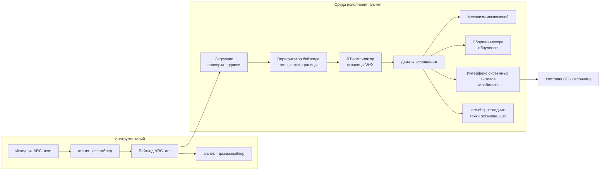
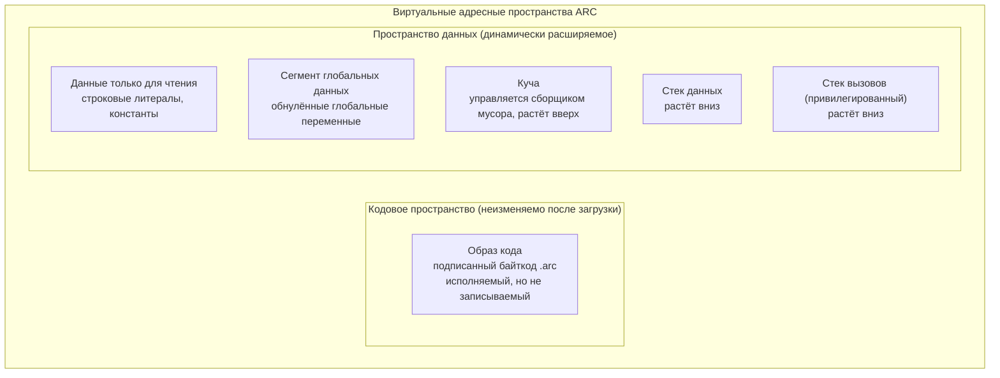
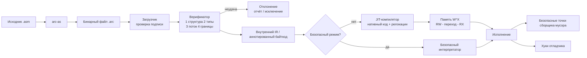
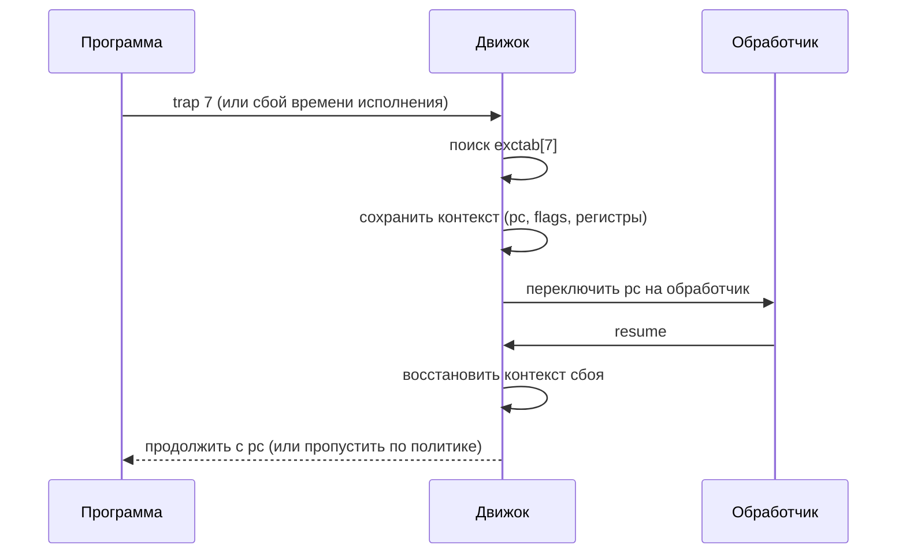

# ARC — Архитектура виртуальной машины

**Проект:** ARC
**Статус:** Черновик v0.1 (проект с нуля)
**Назначение:** сначала общая архитектура, затем детальная спецификация. Документ предназначен для автора проекта и для будущих поколений специалистов, работающих над ARC (среда с максимальными требованиями к конфиденциальности и безопасности, военного назначения).

> **Примечание о переводе.** Настоящий документ — русскоязычная версия файла `ARCHITECTURE.md`. Английская версия считается первоисточником; при расхождениях в деталях приоритет у неё. Код, мнемоники ассемблера, имена регистров и системных вызовов приводятся в оригинальном виде (нижний регистр, как требует синтаксис).

## Содержание

1. Краткое резюме
2. Философия проектирования
3. Решения и обоснования
4. Обзор системы
5. Регистры
6. Модель памяти
7. Типы данных
8. Система команд (ISA)
9. Язык ассемблера (предложение по синтаксису)
10. Формат бинарного файла
11. Модель исполнения
12. JIT-компилятор
13. Параллелизм
14. Соглашение о вызовах
15. Обработка исключений
16. Системные вызовы и ввод-вывод
17. Архитектура безопасности
18. Инструментарий
19. Отладка
20. Дорожная карта
21. Приложения

---

# Часть I — Общая архитектура

## 1. Краткое резюме

ARC — это **регистровая виртуальная машина** (ВМ), написанная на **Go**, с **32-битным размером машинного слова** и **собственным языком ассемблера**. Она исполняет команды фиксированной длины (4 байта) через **JIT-компилятор**, поддерживает **параллелизм** и соблюдает строгое **гарвардское разделение** кода и данных.

ARC спроектирована прежде всего для **максимальной конфиденциальности и безопасности**: безопасность памяти «по построению», подписанный байткод, верифицируемый загрузчик, системные вызовы, ограниченные капабилити (правами), дисциплина W^X и агрессивное обнуление памяти. Производительность — приоритет *после* безопасности.

Полный состав инструментария:

| Инструмент | Роль |
|---|---|
| `arc-as` | Ассемблер: исходник `.asm` → бинарный байткод `.arc` |
| `arc-vm` | Виртуальная машина: загрузчик, верификатор, JIT, среда исполнения |
| `arc-dis` | Дизассемблер: бинарный файл `.arc` → листинг на ассемблере |
| `arc-dbg` | Отладчик: точки останова, пошаговый режим, просмотр памяти и регистров |
| `arcvm` (пакет Go) | Встраиваемый API хоста для интеграции ARC в приложения |

## 2. Философия проектирования

Каждое архитектурное решение подчинено следующей иерархии целей:

1. **Конфиденциальность** — чувствительные данные не должны утекать: между выделениями памяти, на хост, через побочные каналы или после освобождения.
2. **Целостность** — программы не должны поддаваться модификации (байткод обязан быть подписанным и верифицируемым).
3. **Доступность** — программа ARC не должна иметь возможности уронить хост, зависнуть бесконечно или исчерпать ресурсы хоста без ограничений.
4. **Производительность** — скорость исполнения через JIT, приближающаяся к нативной, *после* выполнения перечисленного.
5. **Простота верификации** — семантика должна быть небольшой, типизированной и, где необходимо, детерминированной, чтобы формальные рассуждения о программах ARC были практически осуществимы.

Следствия из проекта:

- **Нет «сырых» указателей.** Все ссылки — управляемые дескрипторы среды исполнения; подделка указателей невозможна. Устраняется целый класс атак на повреждение памяти.
- **Нет чтения неинициализированной памяти.** Любое выделение памяти инициализируется нулями.
- **Нет самокодмодифицирующегося кода.** Гарвардская архитектура: сегмент кода неизменяем после загрузки.
- **Детерминированный режим.** Проверяемый режим исполнения с фиксированным планированием и инструментированием времени для воспроизводимых прогонов.
- **Принцип минимальных привилегий.** Весь ввод-вывод — через системные вызовы, ограниченные капабилити; прямого доступа к оборудованию нет.

## 3. Решения и обоснования

Решения, принятые от лица владельца (каждое можно отменить):

| № | Решение | Выбор | Обоснование |
|---|---|---|---|
| D1 | Порядок байтов | **Little-endian** (младшим байтом вперёд) | соответствует платформам-хостам (x86/ARM); простейшая интеграция |
| D2 | Топология памяти | **Гарвардская** (раздельные код и данные) | W^X «по построению»; невосприимчива к инъекции кода |
| D3 | Управление кучей | **Трассирующий сборщик мусора + немедленное обнуление** (обнуление при выделении и при освобождении) | исключает use-after-free, двойное освобождение и утечки; обнуление предотвращает утечки данных между выделениями и после освобождения |
| D4 | Модель стеков | **Два раздельных стека**: стек вызовов (кадры, адреса возврата) и стек данных (операнды) | стек вызовов привилегирован и недоступен для адресации — адреса возврата невозможно перезаписать ошибкой в данных |
| D5 | Соглашение о вызовах | **Стандартные кадры стека** с `enter`/`leave`, опорой на `fp` | безопасно для рекурсии, поддерживает хвостовые вызовы, удобно для отладки |
| D6 | Ширина команд | **Фиксированные 4 байта** | простой декод, удобно для JIT, предсказуемое выравнивание |
| D7 | Исполнение | **JIT с опциональным запасным безопасным интерпретатором** | скорость — приоритет №4; интерпретатор сохраняется для изолированных и ограниченных сред |
| D8 | Модель исключений | **Синхронные исключения: таблица векторов + `trap`/`resume`** | структурированно, верифицируемо, дружественно к Go |
| D9 | Параллелизм | Потоки ВМ поверх goroutine Go + атомарные операции + синхронизация в стиле futex | соответствует хосту; доступен детерминированный режим |

## 4. Обзор системы



Потоки данных: `arc-as` превращает написанный человеком ассемблер в подписанный верифицируемый бинарный файл; `arc-vm` верифицирует его, JIT-компилирует в нативный код на страницах W^X и исполняет под интерфейсом системных вызовов, ограниченным капабилити. `arc-dis` и `arc-dbg` работают с тем же бинарным форматом.

## 5. Регистры

Все регистры **32-битные**. ARC определяет **16 регистров общего назначения (РОН)** и **5 специальных регистров**.

| Регистр | Класс | Назначение |
|---|---|---|
| r0 – r3 | РОН | аргументы / возврат / временные, разрушаемые вызывающей стороной |
| r4 – r11 | РОН | сохраняемые вызываемой стороной (переживают вызовы) |
| r12 – r13 | РОН | рабочие регистры ассемблера (можно затирать) |
| r14 – r15 | РОН | зарезервированы для среды исполнения ВМ / трамплинов |
| pc | Спец. | счётчик команд (только сегмент кода; программам доступен на чтение) |
| csp | Спец. | указатель стека вызовов (привилегированный, недоступен программам) |
| dsp | Спец. | указатель стека данных |
| fp | Спец. | указатель кадра (якорь текущего кадра вызова) |
| flags | Спец. | флаги условий и состояние машины |

**Раскладка регистра flags:**

| Бит | Имя | Значение |
|---|---|---|
| 0 | z | Ноль (последний результат равен 0) |
| 1 | n | Отрицательный (последний результат отрицателен) |
| 2 | c | Перенос (carry) |
| 3 | v | Переполнение (знаковое) |
| 4 | t | Флаг ловушки (пошаговый режим; устанавливается отладчиком) |
| 5–31 | — | Зарезервировано, всегда 0 |

Замечания по безопасности:

- `r0` — стандартный регистр возврата.
- `pc`, `csp` и `fp` нельзя записать командами пользователя; их изменяют только среда исполнения ВМ и команды `call`, `ret`, `enter`, `leave`, `resume`. Это исключает перехват потока управления через повреждение регистров.
- **Стек вызовов недоступен** из команд работы с данными — адреса возврата невозможно перезаписать ошибкой в данных (решение D4).

## 6. Модель памяти

### 6.1 Топология

Гарвардская архитектура: **код и данные живут в раздельных адресных пространствах**. Код загружается один раз, верифицируется и становится неизменяемым; память данных динамически расширяется.



- **Кодовое пространство**: неизменно после загрузки; любая запись в него или косвенный переход внутрь него — исключение времени исполнения. Это гарантия W^X (решение D2).
- **Данные только для чтения**: строковые литералы и константы; запись — исключение времени исполнения.
- **Глобальные данные**: инициализируются нулями при загрузке.
- **Куча**: растёт динамически; память добавляется страницами; вокруг зарезервированных областей — защитные страницы.
- **Стек данных**: стек операндов (`push`/`pop`); переполнение и опустошение — исключения времени исполнения.
- **Стек вызовов**: привилегированный; содержит кадры и адреса возврата; переполнение порождает исключение переполнения стека.

### 6.2 Расширение и границы

- Память растёт через внутренний **менеджер виртуальной памяти (МВП)**; резервирование ничего не выделяет, выделение — ленивое (страница создаётся при первом обращении), что ограничивает расход ресурсов хоста (цель №3).
- Каждые load/store проверяются по границам. Выход за границы — исключение, а не неопределённое поведение.
- Куча и оба стека окружены **защитными страницами** для обнаружения неконтролируемого доступа.

### 6.3 Управление кучей (сборщик мусора)

Решение D3: **автоматический трассирующий сборщик мусора с немедленным обнулением**.

- **Обнуление при выделении**: свежая память всегда обнуляется — данные не могут утечь *между* выделениями.
- **Обнуление при освобождении/переработке**: когда сборщик мусора перерабатывает объект (или программа явно вызывает `free`), память обнуляется *до* возврата в списки свободных блоков.
- **Уплотняющий сборщик мусора** (mark-and-sweep с уплотнением) — основной план: устраняет фрагментацию, улучшает кэш-поведение. JIT взаимодействует через **безопасные точки** и **точные карты стека**, чтобы уплотнение могло безопасно перемещать объекты.
- **Явный `free`** доступен для чувствительного к производительности кода; среда немедленно обнуляет память и записывает «могилу» (tombstone), так что двойное освобождение порождает исключение, а не порчу памяти.
- Сборщик мусора **инкрементальный** и **с ограниченными паузами** (цель №3).

## 7. Типы данных

ARC — **типизированная** машина: верификатор статически проверяет типы байткода; представления во времени исполнения однозначны.

### 7.1 Примитивные типы

| Тип | Размер | Примечания |
|---|---|---|
| `bool` | 1 байт | только 0 или 1; контролируется |
| `i8` / `u8` | 1 байт | знаковый / беззнаковый |
| `i16` / `u16` | 2 байта | |
| `i32` / `u32` / `f32` | 4 байта (одно слово) | нативные словные типы |
| `i64` / `u64` / `f64` | 8 байт | пары регистров или память |
| `ptr` | 4 байта | **непрозрачный управляемый дескриптор**; никакой «сырой» арифметики |
| `string` | дескриптор 4 байта | неизменяемая UTF-8; управляется средой исполнения |

### 7.2 Модель указателей (автоматическая — производительность и безопасность)

- Указатели — это **непрозрачные дескрипторы**, а не адреса. Программа не может прочитать или записать числовое значение указателя, кроме сравнений на равенство (`==`, `!=`) — подделка указателей невозможна.
- JIT *внутри* использует реальные адреса ради скорости, но ISA предоставляет только дескрипторы: нативная производительность при верифицированной безопасности.
- Действительность указателей гарантирует сборщик мусора: отсутствуют висячие указатели и use-after-free.
- **Массивы с проверкой границ**: команды индексирования проверяются по заголовку длины массива.

### 7.3 Составные типы

| Тип | Раскладка | Примечания |
|---|---|---|
| `array<T>` | заголовок длины + непрерывный `T[]` | фиксируется при создании; проверка границ |
| `struct` | фиксированная раскладка, выравнивание по членам | инициализируется нулями; **заполняющие байты (padding) обнуляются при создании**, чтобы промежутки не хранили устаревшие данные |

### 7.4 Безопасность типов

- Статическая типизация на уровне байткода (типизированные варианты команд и/или типы, выводимые верификатором, см. §11.2).
- Нет объединений (union) и «игры с типами» (type punning) в пользовательском коде.
- Чтение неинициализированной памяти невозможно по построению (выделения обнуляются).

## 8. Система команд (ISA)

### 8.1 Кодирование команд

Все команды занимают ровно **4 байта (одно слово)**. Каждая команда начинается с **полубайта условия** и **полубайта первичного кода операции**, что даёт единообразное условное исполнение (в стиле ARM).

```
Байт 0          Байт 1          Байт 2          Байт 3
+------------------------------------------------------+
| cond (4) | op (4) |  поля операндов (24 бита)         |
+------------------------------------------------------+
биты 31..28     27..24         биты 23..0
```

**Поле условия (`cond`)** — любая команда может исполняться условно:

| cond | Мнемоника | Значение |
|---|---|---|
| 0 | al | Выполнять всегда (по умолчанию) |
| 1 | eq / z | Равно / ноль |
| 2 | ne / nz | Не равно / не ноль |
| 3 | cs / c | Перенос установлен |
| 4 | cc / nc | Перенос сброшен |
| 5 | mi / n | Отрицательный |
| 6 | pl / nn | Положительный или ноль |
| 7 | vs / v | Переполнение установлено |
| 8 | vc / nv | Переполнение сброшено |
| 9 | gt | Больше (со знаком) |
| 10 | ge | Больше или равно (со знаком) |
| 11 | lt | Меньше (со знаком) |
| 12 | le | Меньше или равно (со знаком) |
| 13 | hi | Больше (без знака) |
| 14 | ls | Меньше или равно (без знака) |
| 15 | — | (зарезервировано) |

Мнемоники условий пишутся **строчными** буквами (правило «без ЗАГЛАВНЫХ», §9).

### 8.2 Форматы операндов (24-битное поле операндов)

| Формат | Раскладка (биты 23..0) | Используется |
|---|---|---|
| **RRR** | `rd(5) rs1(5) rs2(5) flags(4) res(5)` | трёхоперандная арифметика/логика |
| **RRI** | `rd(5) rs1(5) imm(14 со знаком)` | два регистра + малая константа |
| **RI** | `rd(5) imm(19 со знаком)` | регистр + константа |
| **RR** | `rd(5) rs1(5) res(14)` | пересылки / два операнда |
| **J** | `offset(20 со знаком, кратно слову)` | переходы/вызовы, относительные PC |
| **S** | `vec(8) res(16)` | векторы syscall / trap |

Свойства:

- Константы **расширяются знаком**. 20-битное смещение J кратно слову (смещение в байтах = слово × 4), охват ±512K слов (±2 МБ) — достаточно для большинства программ; дальние переходы используют косвенную форму (`jmp [r]`).
- Константы шире поля константы используют **пару для загрузки константы**: `ldi` (младшие биты) + `ldhi` (старшие биты), см. справочник команд.
- 64-битные типы используют **пары регистров** `(r_{2n+1}:r_{2n})` — младшее слово в чётном регистре — или операнды в памяти.

### 8.3 Каталог команд

Полная таблица кодов операций назначается при реализации (см. Приложение C). Категории и мнемоники:

**Арифметика**

`add sub mul mulu div divu mod neg inc dec cmp adc sbb`

**Логика и битовые операции**

`and or xor not shl shr sar rol ror test`

**Перемещение данных**

`mov ldi ldhi movhi lea load store loadb storeb loadh storeh`

- `load`/`store` — слово; `loadb`/`storeb` — байт; `loadh`/`storeh` — полуслово.
- Адреса — только в форме `база + смещение`; каждый доступ проверяется по границам.

**Стек (стек данных)**

`push pop pushf popf`

**Поток управления**

`jmp jcc` — все условия из §8.1 (`je jne jl jle jg jge jo jno js jns jc jnc jbe ja ...`)

**Функции**

`call ret enter leave`

- `call`: цель — метка (формат J), регистр или память (указатели на функции).
- `enter size` / `leave` — пролог/эпилог кадра (§14).

**Система и исключения**

`syscall trap resume halt nop`

- `syscall vec` — системный вызов, ограниченный капабилити (§16).
- `trap code` — породить пользовательское исключение (§15).
- `resume` — возврат из обработчика исключения.

### 8.4 Поведение флагов

- Арифметические/логические операции пишут `z n c v` по результату.
- `cmp` / `test` устанавливают флаги, не сохраняя результат.
- Пропущенная условная команда **не имеет побочных эффектов и не порождает исключений**.

## 9. Язык ассемблера (предложение по синтаксису)

> **Статус: ОБНОВЛЁННЫЙ ЧЕРНОВИК.** Учтены требования владельца: простота для разбора и исполнения, читаемость человеком и **никаких ЗАГЛАВНЫХ** — канонический стиль — строчные буквы.

### 9.0 Принципы проектирования

1. **Строчные буквы — канон.** Все мнемоники, директивы, регистры и метки пишутся строчными. Сам парсер нечувствителен к регистру (прощающий ассемблер), но `arc-as --style-check` отвергает прописные токены, чтобы официальный код оставался единообразным. В языке нет ЗАГЛАВНЫХ.
2. **Один токен на операнд.** Операнды разделяются пробелами; запятые необязательны и игнорируются. Памятные операнды пишутся **без внутренних пробелов** (`[r1+4]`) — это один токен.
3. **Нет сокращённых форм.** У каждой команды ровно одна форма (без аккумуляторных сокращений): `add r1, r2, 5` допустимо; `add r1, 5` — отклоняется. Кодирование остаётся табличным, декод JIT — тривиальным.
4. **`#` отмечает константы.** Всё, перед чем стоит `#`, — значение; «голые» идентификаторы — метки или регистры. Нет неоднозначности, нет просмотра вперёд.
5. **Плоские секции.** `.code`, `.data`, `.rodata` заменяют `.section <имя>`.

### 9.1 Лексические соглашения

- **Комментарии**: `;` до конца строки; блочные `/* ... */`. Комментарии удаляются в первую очередь, поэтому `;` внутри строкового литерала комментарием не является.
- **Идентификаторы**: `[a-z_][a-z0-9_]*` (парсер терпит прописные; style-check отвергает). Метки заканчиваются `:`.
- **Числа**: десятичные `42`, шестнадцатеричные `0x2a`, двоичные `0b101010`, восьмеричные `0o52`; числа с плавающей точкой `3.14`, `-1.5e3`; символьные литералы `'a'` с escape-последовательностями.
- **Строки**: в двойных кавычках `"..."` с escape-последовательностями `\n \t \\ \" \xNN \uNNNN`.
- **Регистры**: `r0`–`r15`; специальные `pc`, `dsp`, `fp`, `flags` (`csp` программам недоступен).

### 9.2 Формы операндов

| Форма | Пример | Примечания |
|---|---|---|
| Регистр | `r3` | `r0`–`r15`, `pc`, `dsp`, `fp` |
| Константа | `#42`, `#0x2a`, `#limit` | значение или имя константы |
| Метка | `loop` | адрес данных или кода; разрешается при сборке |
| Память | `[r1+4]`, `[r1+r2*4]`, `[r1]` | **без пробелов внутри скобок**; формы: `[base]`, `[base+off]`, `[base+index*scale]`, `scale` ∈ {1,2,4,8} |
| Косвенный вызов | `[r7]` как единственная цель | указатели на функции: `call [r7]` |

### 9.3 Грамматика (формальная)

```
program       := (label | directive | instruction | comment)*
label         := ident ':'
directive     := '.' mnemonic (operand (','? operand)*)?
instruction   := mnemonic ['.' cond] (operand (','? operand)*)?
operand       := '#' (number | ident) | reg | '[' memexpr ']' | ident | number | string
memexpr       := reg ('+' (reg ['*' scale] | number))?
comment       := ';' rest | '/*' text '*/'
```

Грамматика однозначна: число операндов каждой мнемоники фиксировано и задано таблицей; суффикс условия (см. §9.5) число операндов не меняет. Именно это делает ассемблер ARC тривиально разбираемым и дёшевым в сборке.

### 9.4 Директивы

| Директива | Значение |
|---|---|
| `.code` / `.data` / `.rodata` | Переключение текущей секции |
| `.word v1, v2, ...` | Выделить 32-битные слова |
| `.half v1, ...` | Выделить 16-битные значения |
| `.byte v1, ...` | Выделить 8-битные значения |
| `.string "..."` | Строка UTF-8 с завершающим нулём (автоматически в `.rodata`) |
| `.const имя значение` | Именованная константа (во время сборки), напр. `.const limit 40` |
| `.align n` | Выровнять по n байт |
| `.global имя` | Экспорт символа |
| `.extern имя` | Импорт символа |
| `.macro имя арг...` / `.endm` | Определение макроса |
| `.org адрес` | Установить выходной адрес |

### 9.5 Мнемоники и условия

- Мнемоники — строчные имена из §8.3 (`mov`, `add`, `call`, `syscall`, ...).
- **Переходы** всегда несут своё условие: `je`, `jne`, `jl`, `jle`, `jg`, `jge`, `jo`, `jno`, `js`, `jns`, `jc`, `jnc`, `jbe`, `ja`; `jmp` — безусловная форма.
- **Предикатная арифметика** (опционально, отражает полубайт условия ISA): условие дописывается к мнемонике — `add.eq r0, r0, r1`. Безусловная форма — по умолчанию; в рукописном коде предпочитается явный `je`.

### 9.6 Пример программы (строчный стиль)

```
; ---------------------------------------------------------------
; сумма элементов массива
; строчный стиль, один токен на операнд, константы с префиксом #
; ---------------------------------------------------------------
.const arr_len 4

.rodata
msg:   .string "sum: "

.data
arr:   .word 10, 20, 30, 40

.code
.global entry
entry:
    enter 0                 ; пролог
    mov  r1, arr            ; дескриптор массива (непрозрачный указатель)
    mov  r0, #0             ; аккумулятор
    mov  r2, #0             ; индекс
loop:
    cmp  r2, #arr_len
    jge  done               ; знаковое >=
    load r3, [r1+r2*4]      ; индексированная загрузка с проверкой границ
    add  r0, r0, r3
    inc  r2
    jmp  loop
done:
    syscall 1               ; write(stdout, msg)
    syscall 3               ; write_int(stdout, r0)
    syscall 0               ; exit(0)
    halt
```

### 9.7 Гарантии ассемблера и политика стиля

- `arc-as` разрешает все метки и константы на этапе сборки; готовый `.arc` не требует разрешения символов при загрузке.
- Ассемблер доводит `.code` до выравнивания по слову, исправляет смещения формата `j` относительно PC и отклоняет суффикс условия, конфликтующий с формой `jcc`.
- Индексированная форма `[r1+r2*4]` кодируется через полубайт `flags` форматов RRR/RRI (§8.2); верификатор подтверждает границы индекса там, где это статически известно.
- **Правило «без ЗАГЛАВНЫХ» — механическое**: `arc-as --style-check` выдаёт ошибку на любую прописную мнемонику, директиву или имя регистра.

---

# Часть II — Детальная спецификация

## 10. Формат бинарного файла

Бинарный файл `.arc` — собственный формат с защитой целостности.

```
+------------------------------------------------------+
| Магия        "ARCV1" (4 байта)                        |
| Версия       u32                                      |
| Флаги        u32  (bit0: требует JIT,                 |
|                    bit1: требует детерминированный    |
|                    режим, ...)                        |
| Точка входа  u32  (смещение кода для entry)           |
| Таблица секций: count + [имя, тип, vaddr, размер,     |
|                  смещение в файле, права, хэш]        |
| Секции:       code (неизменяемая)                     |
|               rodata                                  |
|               data                                    |
|               symtab (символы + информация о строках)  |
|               exctab (векторы исключений)             |
| Подпись      Ed25519 поверх всего вышеперечисленного  |
+------------------------------------------------------+
```

- **Подпись**: каждый боевой бинарный файл `.arc` подписан (Ed25519). `arc-vm` отказывается загружать неподписанные или недействительно подписанные файлы, если только это не отменено явно в режиме разработки.
- **Хэши секций** (SHA-256) позволяют проверять целостность инкрементально и безопасно загружать без копирования.
- **symtab** несёт символы и соответствие строк исходника — для дизассемблера и отладчика.
- **exctab** сопоставляет векторы исключений с адресами обработчиков (§15).

### 10.1 Стабильность ABI

Формат бинарного файла **версионируется**. Загрузчик принимает ровно одну версию формата на файл (без молчаливых трюков совместимости); развитие формата идёт через поле версии и документируется в журнале изменений.

## 11. Модель исполнения

### 11.1 Конвейер



### 11.2 Верификация при загрузке (верификатор)

До запуска любого кода `arc-vm` выполняет **статическую верификацию**, которая *по умолчанию пессимистична*:

1. **Структурный проход** — границы команд, выравнивание, валидность кода операции/формата, проверка зарезервированных битов.
2. **Проход типов** — типы операндов отслеживаются статически; несоответствия типов отклоняются (никакой путаницы типов во время исполнения).
3. **Проход потока управления** — цели переходов/вызовов внутри секции кода на границах команд; нет «провала» за конец кода; глубина вызовов ограничена там, где это проверяемо.
4. **Проход границ** — смещения, статически доказуемо находящиеся в границах; остальное покрывается явными проверками времени исполнения, которые вставляет JIT.
5. **Ресурсный проход** — расход стека на кадр статически ограничен; суммарные обязательства по памяти ограничены политикой хоста (цель №3).

Всё, что верификатор не может доказать безопасным, либо (а) инструментируется проверкой времени исполнения, либо (б) отклоняется.

### 11.3 Движки

- **Основной движок: JIT** (§12).
- **Запасной движок: безопасный интерпретатор** — цикл на switch по верифицированному байткоду, для сред, где JIT запрещён (изолированные среды, формально гарантированные развёртывания) — решение D7.
- Оба движка используют общую инфраструктуру сборщика мусора, исключений и системных вызовов. **Детерминированный режим** гарантирует побитово идентичные результаты между движками.

## 12. JIT-компилятор

### 12.1 Стратегия

- **Пофункциональный JIT с ленивой компиляцией**: функции компилируются при первом вызове, затем кэшируются за стабами нативного кода. Профилирование горячих путей — пункт дорожной карты (не входит в начальный объём).
- Результат: **позиционно-независимый машинный код** хоста (сначала amd64, затем arm64).
- **Дисциплина W^X**: код создаётся в памяти RW, затем переводится в RX. Никогда не RWX.
- **ASLR**: буферы JIT размещаются по случайным адресам при каждом запуске.

### 12.2 Механизмы безопасности

| Угроза | Меры |
|---|---|
| Инъекция кода | W^X; буфер кода никогда не доступен на запись после публикации |
| Return-oriented programming | Адреса возврата — на привилегированном стеке вызовов (эквивалент теневого стека, обеспечивает ВМ) |
| Spectre (JIT) | Генерация кода с константным временем для чувствительных операций; сериализующие барьеры вокруг ветвлений, зависящих от секретов (управляется политикой) |
| Класс Meltdown | Неприменимо — ВМ не касается памяти ядра; только среда исполнения |

### 12.3 Интеграция со сборщиком мусора

- **Точные карты стека**: JIT записывает местоположения живых ссылок для каждой безопасной точки, чтобы сборщик мусора мог перемещать/уплотнять объекты.
- Безопасные точки размещаются на обратных рёбрах (back-edges) и вызовах; длинные циклы периодически уступают управление.

### 12.4 Политика константного времени / побочных каналов

- ISA и JIT поддерживают **варианты с константным временем выполнения** арифметики (например, `ct_add`) для криптографического и особо чувствительного кода.
- В **детерминированном режиме** время исполнения инструментируется и воспроизводимо (для тестовых и проверочных прогонов).

## 13. Параллелизм

- Потоки ВМ лёгкие и отображаются на goroutine Go на хосте.
- Общая память разрешена только для явно разделяемых объектов сборщика мусора; среда предоставляет:

| Примитив | Назначение |
|---|---|
| Команды `atomic_*` (`atomic_add`, `atomic_xchg`, `atomic_cmpxchg`; load/store с acquire/release) | Обновления без блокировок |
| `syscall mutex_lock / mutex_unlock` | Блокирующая взаимная исключительность |
| `syscall sem_wait / sem_post` | Семафоры |
| `syscall futex_wait / futex_wake` | Низкоуровневые ожидания (в стиле futex) |
| `syscall thread_create / thread_join / thread_yield` | Жизненный цикл потоков |

- **Детерминированный режим**: фиксированный квант планирования round-robin и отсутствие зависимостей от времени хоста — воспроизводимое поведение параллельных программ для верификации.

## 14. Соглашение о вызовах

Решение D5 — стандартные кадры стека.

### 14.1 Правила

- **Регистры аргументов**: первые 4 аргумента в `r0`–`r3`; остальные помещаются в **стек данных** (в документированном порядке — вызываемая сторона снимает их в локальные переменные в прологе).
- **Возвращаемое значение**: `r0` (32 бита). 64-битные возвраты используют пару `r1:r0`.
- **Разрушаемые вызывающей стороной** (caller-saved): `r0`–`r3` (затираются вызовами).
- **Сохраняемые вызываемой стороной** (callee-saved): `r4`–`r11` (переживают вызовы).
- **Рабочие**: `r12`–`r13` (временные ассемблера, без гарантий сохранности).
- **Зарезервированные**: `r14`–`r15` (только среда исполнения ВМ; пользовательский код должен считать их изменчивыми).
- **Дисциплина кадра**: `call` кладёт адрес возврата в **стек вызовов**; `enter n` выделяет кадр и копирует `fp`; `leave` восстанавливает; `ret` снимает адрес возврата. Кадры живут на стеке вызовов; операнды/локальные переменные за пределами регистров — на стеке данных.

### 14.2 Раскладка кадра


- `enter size`: выделяет `size` байт обнулённых локальных переменных в области стека данных, связанной с кадром, и связывает записи с якорем `fp := csp`. Точное кодирование домашнего кадра определяется реализацией, но версионируется.
- **Рекурсия**: полностью поддерживается (каждый вызов кладёт новый кадр).
- **Хвостовые вызовы**: JIT переписывает цепочки `call`+`ret` в переходы, когда кадр вызывающей стороны мёртв — необходимо для глубокой рекурсии в критичных к безопасности циклах.
- **Указатели на функции**: любой дескриптор символа-функции; вызов через `call [r]` / `call [mem]`; верификатор подтверждает, что цель — действительный указатель на код.

## 15. Обработка исключений

Решение D8 — структурированные синхронные исключения.

### 15.1 Модель

- **Источники исключений**: пользовательские `trap code`, сбои времени исполнения (деление на ноль, выход за границы, переполнение стека, разыменование null, неразрешимый системный вызов) и события отладчика (точка останова, пошаговый режим с флагом `t`).
- **Таблица исключений (exctab)**: сопоставляет номера векторов с адресами обработчиков; устанавливается при загрузке из секции `.arc`, расширяется во время исполнения через `syscall exc_register`.
- **Доставка**: при исключении движок:
  1. записывает контекст сбоя (pc, flags, регистры) в запись контекста исключения,
  2. переключается на обработчик вектора (побеждает наиболее специфичный обработчик),
  3. сбрасывает `t`, кроме режима отладки.
- **Вложенные исключения**: допустимы до предела глубины (настраивается политикой хоста); превышение предела детерминированно завершает прогон.
- **Необработанное исключение**: ВМ останавливается с структурированным кодом ошибки и записью аудита (см. §16).



### 15.2 Отображение на сторону Go

- Хост-API представляет исключения как типизированные ошибки Go / сигналы в стиле `panic` с полным контекстом ARC (вектор, pc, цепочка обработчиков) для журналирования и криминалистики.

## 16. Системные вызовы и ввод-вывод

### 16.1 Модель капабилити

- **Нет прямого доступа к оборудованию или ОС** — всё взаимодействие с хостом идёт через команду `syscall` с вектором в константе и аргументами в регистрах `r0`–`r3`.
- Каждая программа запускается с явным **набором капабилити** (выдаётся политикой хоста, принцип минимальных привилегий). Системный вызов вне набора порождает исключение капабилити.
- Капабилити переносится в непрозрачном токене, который программы не могут подделать или расширить.

### 16.2 Начальная таблица системных вызовов (номера векторов закрепляются при реализации)

| vec | Системный вызов | Требуемое капабилити |
|---|---|---|
| 0 | `exit(status)` | всегда |
| 1 | `write(fd, ptr, len)` | `io.write.<fd>` |
| 2 | `read(fd, ptr, len)` | `io.read.<fd>` |
| 3 | `write_int(fd, i32)` | `io.write.<fd>` |
| 4 | `open(path, mode)` | `fs.open.<path>` (белый список путей) |
| 5 | `close(fd)` | — |
| 6 | `time()` | `time` |
| 7 | `random(buf, len)` | `crypto.rng` (только CSPRNG хоста) |
| 8 | `thread_create / thread_join / thread_yield` | `threads` |
| 9 | `mutex_lock / mutex_unlock` | `sync` |
| 10 | `sem_wait / sem_post` | `sync` |
| 11 | `futex_wait / futex_wake` | `sync` |
| 12 | `exc_register(vec, handler)` | `exc` |
| 13 | `audit(record)` | `audit.write` |
| 14 | `secure_wipe(ptr, len)` | всегда (обнуляет; эквивалент GC) |

- **stdin/stdout/stderr** — предоткрытые дескрипторы `0`, `1`, `2`.
- **Журнал аудита**: события, значимые для безопасности (вход/выход из системных вызовов, исключения, отказы капабилити, обнуления GC), могут записываться в проверяемый хостом журнал; включение — решение политики при загрузке.

## 17. Архитектура безопасности

В этом разделе все свойства безопасности сводятся в единую модель угроз и требования.

### 17.1 Защищаемые активы

1. Данные программ в памяти (конфиденциальность в состоянии покоя и в движении).
2. Целостность кода программ (подлинность бинарного файла).
3. Целостность и доступность хоста (песочница).

### 17.2 Модель угроз

| Угроза | Защита |
|---|---|
| Злонамеренный байткод (инъекция, эксплуатация) | Подписанные файлы + статический верификатор + W^X + безопасность памяти |
| Утечка данных между процессами/выделениями | Обнуление при выделении, обнуление при освобождении, защитные страницы |
| Подмена программы или её входных данных | Подписи Ed25519, SHA-256 для каждой секции |
| Вынос данных через ввод-вывод | Системные вызовы, ограниченные капабилити; белые списки путей; аудит |
| Побочные каналы (время, кэш) | Варианты с константным временем; детерминированный режим; сериализующие барьеры по политике |
| Захват хоста гостевым кодом | Нет «сырых» указателей; системные вызовы только в песочнице; ограниченные ресурсные обязательства |
| Обратная разработка секретных процедур | (Опционально, дорожная карта): этап обфускации байткода в `arc-as`; развёртывания только на безопасном интерпретаторе |

### 17.3 Инварианты безопасности (должны выполняться всегда)

1. Каждая исполняемая команда либо статически верифицирована, либо покрыта проверкой времени исполнения.
2. Ни одна операция гостя не может прочитать память процесса хоста.
3. Ни одна операция гостя не может записать память кода (W^X).
4. Освобождённая или невыделенная память никогда не читается.
5. Ни одно капабилити нельзя подделать или расширить.
6. Исполнение ограничено по времени и памяти (по политике хоста) — никаких бесконечных циклов без точек прерывания, никакого неограниченного выделения.
7. В детерминированном режиме одинаковые входные данные дают побитово одинаковые выходные данные и одинаковые записи аудита.

### 17.4 Заметки по реализации на Go

- Ядро ВМ (пакет `arcvm`) должно избегать `unsafe`, кроме тщательно рецензируемых внутренностей (генерация JIT, перемещение объектов GC); любой выход указателей к гостевому коду — через абстракцию дескрипторов.
- Страницы кода JIT управляются выделенным аллокатором через платформенные `mmap`/`VirtualAlloc` с надлежащими защитами страниц; нигде нет отображений `RWX`.
- Все точки паники Go восстанавливаются на границе ВМ и превращаются в исключения ARC с полным контекстом.

## 18. Инструментарий

| Инструмент | Язык | Ответственность |
|---|---|---|
| `arc-as` | Go | Разбор исходника ARC → выпуск подписанного `.arc`; раскрытие макросов; `.const`; раскладка секций; фиксация смещений |
| `arc-vm` | Go | Загрузка, верификация, JIT/интерпретация, исполнение; CLI для запуска `.arc` с флагами политики (`--secure-mode`, `--deterministic`, `--capabilities=...`, `--audit=file`) |
| `arc-dis` | Go | Дизассемблирование `.arc` → аннотированный листинг (адреса, байты, символы) |
| `arc-dbg` | Go | Интерактивный отладчик (точки останова, пошаговый режим, точки наблюдения, просмотр памяти/регистров, трассировка) |
| пакет `arcvm` | Go | Встраиваемый API: `vm := arcvm.New(cfg); vm.Load(bin); vm.Run()` |

Пример CLI:

```
arc-vm --secure-mode --deterministic --capabilities=io.write.1,time,audit.write prog.arc
```

## 19. Отладка

### 19.1 Точки останова

- **Программные точки останова**: `bkp` кодируется как отладочный вариант `trap`; среда исполнения патчит образ потока команд (образ кода изменяем только в режиме отладки) и восстанавливает при продолжении.
- **Аппаратные точки останова (JIT)**: JIT вставляет хуки проверки на отмеченных адресах; используется, когда страница кода должна оставаться доступной только на чтение.

### 19.2 Возможности

| Возможность | Механизм |
|---|---|
| Пошаговый режим | Установить флаг `t` → ловушка после одной команды |
| Точки наблюдения | Защита страниц МВП + детекция записи в JIT |
| Трассировка стека | Обход цепочки кадров по стеку вызовов |
| Просмотр дизассемблера | Вывод `arc-dis` встроенно |
| Детерминированное воспроизведение | Запись системных вызовов/событий GC при загрузке для воспроизведения |

## 20. Дорожная карта

| Фаза | Объём |
|---|---|
| 0 (текущая) | Базовая линия спецификации; скелет проекта Go; ассемблер + цикл ВМ (интерпретатор) |
| 1 | Верификатор; формат бинарного файла v1; `arc-dis`; базовое отлаживание |
| 2 | JIT (amd64); уплотнение GC + обнуление; примитивы параллелизма |
| 3 | Полный отладчик; подсистема аудита; JIT arm64; операции с константным временем |
| 4 | Средства формальной верификации; этап обфускации; инструментарий проверенных распределённых развёртываний |

## 21. Приложения

### Приложение A — Терминология

| Термин | Определение |
|---|---|
| W^X | Write XOR eXecute: страница либо доступна на запись, либо на исполнение, никогда обе сразу |
| Безопасная точка (safe-point) | Место в командах, где сборщик мусора может безопасно проверить/переместить живые ссылки |
| Карта стека (stack map) | Запись местоположений живых ссылок для каждой безопасной точки — для сборщика мусора |
| Капабилити | Неподделываемый токен, дающий право на конкретный системный вызов |
| Гарвардская архитектура | Раздельные адресные пространства кода и данных |
| Детерминированный режим | Режим исполнения с воспроизводимым планированием и временем |
| Теневой стек | Дублирующее хранилище адресов возврата для защиты от их подмены |

### Приложение B — Размеры и константы (нормативные)

| Константа | Значение |
|---|---|
| Размер слова | 32 бита |
| Ширина команды | 4 байта (фиксировано) |
| Число РОН | 16 |
| Специальные регистры | 5 (pc, csp, dsp, fp, flags) |
| J-смещение | 20 бит со знаком, кратно слову (охват ±2 МБ) |
| Константа RRI | 14 бит со знаком |
| Константа RI | 19 бит со знаком |
| Выравнивание объектов | 4 байта (64-битные типы: 8 байт) |
| Обнуление GC | перед освобождением, перед повторным использованием, при выделении |
| Максимальная глубина вызовов (по умолчанию) | 10 000 (настраивается политикой) |

### Приложение C — Назначение кодов операций (распределение при реализации)

Зарезервированные диапазоны полубайта операции по категориям (могут меняться):

| Диапазон op (предварительно) | Категория |
|---|---|
| `0x0x` | Арифметика |
| `0x1x` | Логика / битовые операции |
| `0x2x` | Перемещение данных / память |
| `0x3x` | Стек (стек данных) |
| `0x4x` | Поток управления / переходы |
| `0x5x` | Функции (call/ret/enter/leave) |
| `0x6x` | Система (syscall/trap/resume/halt/nop) |
| `0x7x–0xFx` | Зарезервировано / расширение |

### Приложение D — Открытые вопросы

1. Дальнейшая доводка **синтаксиса ARC-ассемблера**: строчная/упрощённая редакция (§9) принята как базовая; финальный список мнемоник и синтаксис макросов ещё предстоит утвердить.
2. Обработка 64-битных типов: пары регистров против выделенных широких регистров.
3. Окончательный выбор алгоритма сборщика мусора (уплотняющий mark-sweep против копирующего) по итогам бенчмарков.
4. Поставлять ли начальную **стандартную библиотеку** верифицированных примитивов (строковые операции, криптография, контейнеры).
5. Управление ключами подписи боевых выпусков (офлайн-ЦС, процедуры с ключами).

---

*Конец документа. Изменения любого решения (D1–D9) фиксируются здесь по мере развития спецификации.*